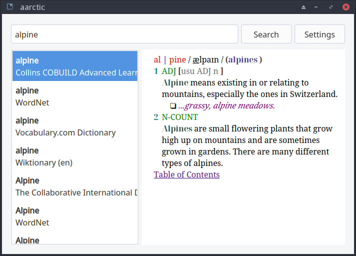

# aarctic

Simplistic PyQt5 desktop client for [Aard2](https://aarddict.org). 

## Installation & Usage
Clone repository and `pip install .`, then start from shell with  `aarctic`.

You may want to get some .slob dictionaries [here](https://github.com/itkach/slob/wiki/Dictionaries).

## Known Issues
- No prebuilt binaries... for now. I've tried several packaging solutions tirelessly - pyinstaller, briefcase, etc - and failed. I really don't know a thing on how to build and package PyQt applications properly. For now you need to `pip install` it yourself though a .desktop file for Linux is provided. I'm sorry...
- High memory usage (~45MB idle), memory leak while switching pages - possibly due to PyQt/QWebView limitations and the use of a HTTP server backend (Bottle, though it's indeed lightweight). Tried to optimize but with little progress; will continue working on it in the future.

> In short, I really lack real-world development experience in this field... Looking forward to having someone tutor me :(
## Changelog
see [CHANGELOG.md](CHANGELOG.md).

## TODO
- [ ] Better support for keyboard control
- [ ] Full Dark Mode / dictionary custom CSS theme support
- [x] Change backend
- [ ] **Optimize performance**

## License 
GPLv3
